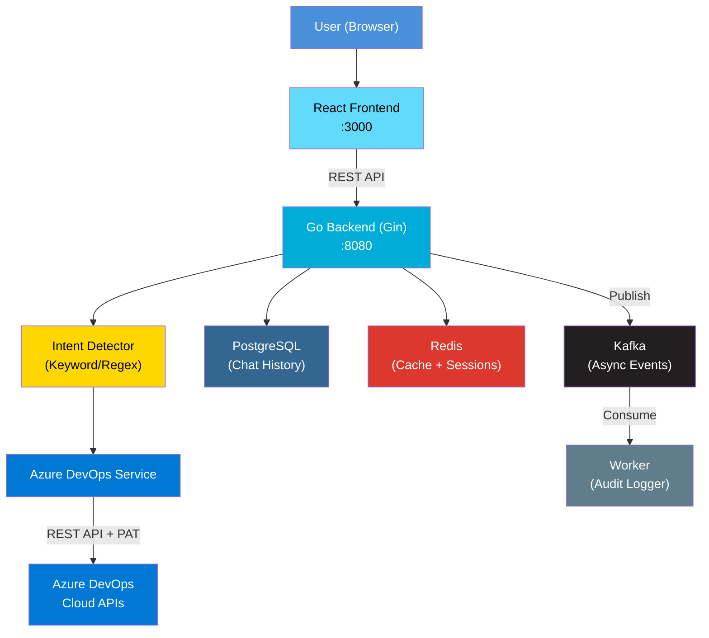
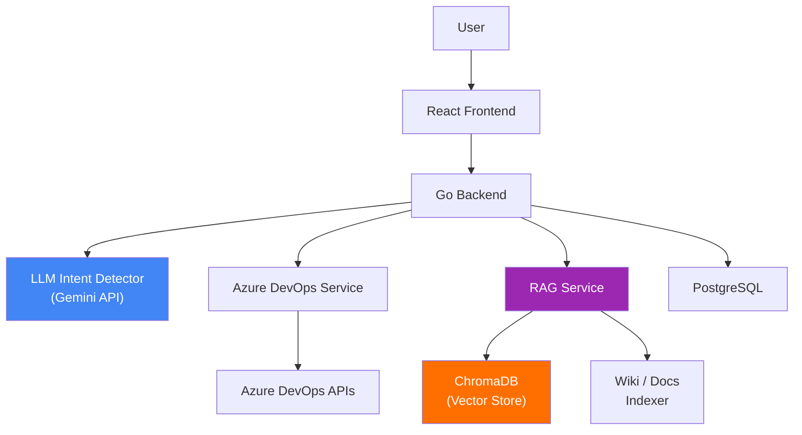
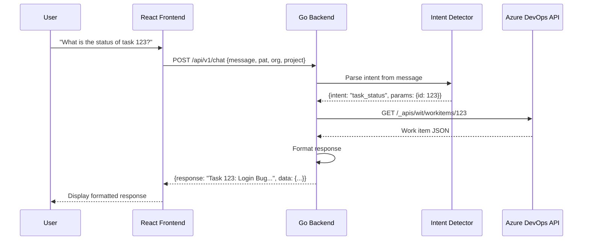
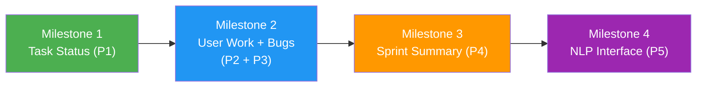
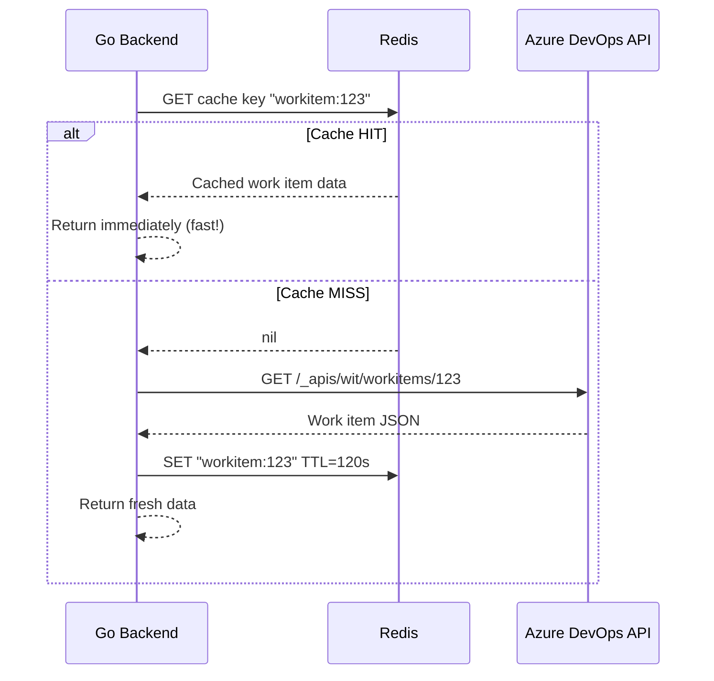
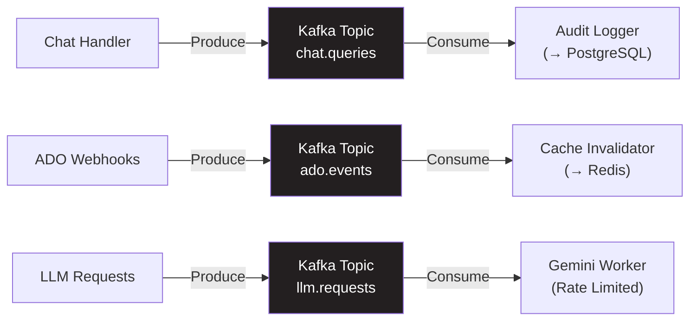

# Azure DevOps AI Assistant — Architecture & Implementation Plan

## Table of Contents
1. [Finalized Tech Stack](#1-finalized-tech-stack)
2. [System Architecture](#2-system-architecture)
3. [Azure DevOps Setup & Permissions](#3-azure-devops-setup--permissions)
4. [API Endpoints Design](#4-api-endpoints-design)
5. [Project Structure](#5-project-structure)
6. [MVP Phasing Strategy](#6-mvp-phasing-strategy)
7. [Week-by-Week Plan](#7-week-by-week-plan)
8. [Potential Blockers & Mitigations](#8-potential-blockers--mitigations)
9. [Deployment Strategy](#9-deployment-strategy)
10. [Redis & Kafka Integration](#10-redis--kafka-integration)

---

## 1. Finalized Tech Stack

| Layer | Technology | Why |
|:------|:-----------|:----|
| **Frontend** | React + Vite + Tailwind CSS v4 | Fast dev server, modern CSS, hot reload |
| **Backend** | Go + Gin | Most popular Go framework (88k+ GitHub stars), battle-tested |
| **Database** | PostgreSQL | Reliable, your preference |
| **LLM (Primary)** | Google Gemini (AI Studio free tier) | Free, no expiration, Flash models available |
| **LLM (Fallback)** | Grok API (xAI promotional credits) | $25 sign-up bonus, usage-based after |
| **Intent Detection (MVP)** | Keyword/Regex matching | Simple, no LLM cost, upgrade later |
| **Cache** | Redis | API response caching, session store, rate limiting |
| **Message Queue** | Kafka (via Docker) | Async processing, webhooks, audit logging |
| **Containerization** | Docker + Docker Compose | Local dev + deployment |

> [!NOTE]
> **Gemini Free Tier**: Access via Google AI Studio. No time limit. Rate limits are per-project (RPM/TPM/RPD). Flash models are free. Your data may be used by Google to improve products on the free tier.

---

## 2. System Architecture

### MVP Architecture (Phase 1)



### Future Architecture (Phase 2-3)



### Request Flow (MVP)



---

## 3. Azure DevOps Setup & Permissions

### PAT (Personal Access Token) Creation

> [!IMPORTANT]
> You need a PAT to access Azure DevOps APIs. Here's exactly what permissions to set.

**Steps to create PAT:**
1. Go to `https://dev.azure.com/{your-org}`
2. Click **User Settings** (gear icon, top right) → **Personal Access Tokens**
3. Click **+ New Token**
4. Set the following scopes:

| Scope | Access Level | Required For |
|:------|:------------|:-------------|
| **Work Items** | Read | Task status, bugs, sprint queries |
| **Project and Team** | Read | Project listing, team members |
| **Build** | Read | Pipeline info (future) |
| **Code** | Read | Repos (future) |
| **Wiki** | Read | Wiki search (Phase 3) |
| **Graph** | Read | User lookups |
| **Analytics** | Read | Sprint analytics |

> [!WARNING]
> - PAT expires after a set period (max 1 year). Users must refresh it.
> - Do NOT use "Full Access" — follow least privilege.
> - Free Azure DevOps orgs support up to 5 users with Basic access.

### Key Azure DevOps API Endpoints We'll Use

| Feature | API Endpoint | Method |
|:--------|:------------|:-------|
| Get work item by ID | `/_apis/wit/workitems/{id}` | GET |
| Query work items (WIQL) | `/_apis/wit/wiql` | POST |
| List iterations/sprints | `/{project}/{team}/_apis/work/teamsettings/iterations` | GET |
| Get iteration work items | `/{project}/{team}/_apis/work/teamsettings/iterations/{id}/workitems` | GET |
| Get team members | `/_apis/projects/{project}/teams/{team}/members` | GET |

> [!NOTE]
> **WIQL quirk**: The WIQL endpoint only returns work item **IDs**. You must make a second call to `/_apis/wit/workitems?ids=1,2,3` to get full details. This is a two-step process we must handle in the backend.

---

## 4. API Endpoints Design

### Backend REST API

```
Base URL: http://localhost:8080/api/v1
```

| Endpoint | Method | Purpose | MVP Phase |
|:---------|:-------|:--------|:----------|
| `/api/v1/chat` | POST | Main chat endpoint | P1 |
| `/api/v1/health` | GET | Health check | P1 |
| `/api/v1/config/validate` | POST | Validate Azure DevOps credentials | P1 |

### Chat Request/Response Schema

**Request:**
```json
{
  "message": "What is the status of task 123?",
  "context": {
    "organization": "my-org",
    "project": "my-project",
    "pat": "base64-encoded-pat"
  }
}
```

**Response:**
```json
{
  "response": "Task #123: Fix Login Bug\n- Status: Active\n- Assigned To: Rahul\n- Priority: 2\n- Sprint: Sprint 5",
  "intent": "task_status",
  "data": {
    "id": 123,
    "title": "Fix Login Bug",
    "state": "Active",
    "assignedTo": "Rahul",
    "priority": 2,
    "sprint": "Sprint 5"
  }
}
```

---

## 5. Project Structure

### Backend Repository: `sprintgpt-backend`

```
sprintgpt-backend/
├── cmd/
│   └── server/
│       └── main.go              # Entry point
├── internal/
│   ├── config/
│   │   └── config.go            # App configuration
│   ├── handler/
│   │   ├── chat.go              # Chat endpoint handler
│   │   └── health.go            # Health check handler
│   ├── intent/
│   │   ├── detector.go          # Intent detection interface
│   │   └── keyword_detector.go  # Keyword/regex implementation
│   ├── azuredevops/
│   │   ├── client.go            # HTTP client for ADO APIs
│   │   ├── workitems.go         # Work item operations
│   │   ├── sprints.go           # Sprint operations
│   │   └── types.go             # ADO response types
│   ├── cache/
│   │   └── redis.go             # Redis client + cache helpers
│   ├── queue/
│   │   ├── producer.go          # Kafka producer (publish events)
│   │   └── consumer.go          # Kafka consumer (process events)
│   ├── formatter/
│   │   └── response.go          # Format ADO data → human text
│   └── middleware/
│       ├── cors.go              # CORS middleware
│       ├── ratelimit.go         # Redis-based rate limiting
│       └── logger.go            # Request logging
├── pkg/
│   └── models/
│       └── models.go            # Shared models
├── Dockerfile
├── docker-compose.yml
├── go.mod
└── go.sum
```

### Frontend Repository: `sprintgpt-frontend`

```
sprintgpt-frontend/
├── src/
│   ├── components/
│   │   ├── Chat/
│   │   │   ├── ChatWindow.jsx       # Main chat container
│   │   │   ├── MessageBubble.jsx     # Individual message
│   │   │   ├── InputBar.jsx          # Message input
│   │   │   └── TypingIndicator.jsx   # Loading animation
│   │   ├── Settings/
│   │   │   └── ConfigPanel.jsx       # PAT/org/project config
│   │   └── Layout/
│   │       ├── Sidebar.jsx           # Navigation sidebar
│   │       └── Header.jsx            # Top header bar
│   ├── hooks/
│   │   ├── useChat.js               # Chat state management
│   │   └── useConfig.js             # Config state management
│   ├── services/
│   │   └── api.js                   # Backend API calls
│   ├── App.jsx
│   ├── main.jsx
│   └── index.css                    # Tailwind imports
├── Dockerfile
├── package.json
├── vite.config.js
└── tailwind.config.js (optional with v4)
```

---

## 6. MVP Phasing Strategy

Instead of building all 5 features at once, we'll build incrementally:



### Milestone 1 — Task Status Lookup (P1)
**Goal:** End-to-end flow working with a single feature.

- Backend: Gin server + Azure DevOps client + single endpoint
- Frontend: Chat UI + config panel + message display
- Intent: Hardcoded regex `task (\d+)` or `status of task (\d+)`
- **This proves the entire architecture works**

### Milestone 2 — User Work + Active Bugs (P2 + P3)
**Goal:** Add WIQL queries for filtering work items.

- Backend: WIQL query builder for user-assigned items and active bugs
- Intent: Add regex patterns for user queries and bug queries
- Frontend: Display list-type responses (tables/cards)

### Milestone 3 — Sprint Summary (P4)
**Goal:** Aggregate sprint data.

- Backend: Sprint/iteration API integration, aggregation logic
- Frontend: Summary cards with counts (total/completed/in-progress/blocked)

### Milestone 4 — NLP Upgrade (P5)
**Goal:** Replace regex with Gemini for intent detection.

- Integrate Gemini API for natural language understanding
- Support flexible, conversational queries
- Fallback to keyword matching if LLM fails/rate-limited

---

## 7. Week-by-Week Plan

### Week 1: Foundation & P1 Backend
| Day | Task |
|:----|:-----|
| 1 | Set up Go project with Gin, project structure, Docker |
| 2 | Build Azure DevOps HTTP client (auth, base URL, error handling) |
| 3 | Implement `GetWorkItem(id)` — fetch single work item by ID |
| 4 | Build intent detector (regex) + chat handler endpoint |
| 5 | Test end-to-end: POST to `/api/v1/chat` → get task status |

**Deliverable:** Backend returns task status via API.

### Week 2: P1 Frontend + P2/P3 Backend
| Day | Task |
|:----|:-----|
| 1 | Set up React + Vite + Tailwind project |
| 2 | Build ChatWindow, MessageBubble, InputBar components |
| 3 | Build ConfigPanel (PAT, org, project inputs) |
| 4 | Connect frontend to backend, test P1 end-to-end |
| 5 | Backend: Implement WIQL queries for P2 (user work) and P3 (active bugs) |

**Deliverable:** Working UI for task status. Backend ready for P2/P3.

### Week 3: P2/P3/P4 Complete + Polish
| Day | Task |
|:----|:-----|
| 1 | Frontend: Support list-type responses for P2/P3 |
| 2 | Backend: Sprint iteration API integration for P4 |
| 3 | Backend: Sprint aggregation logic (counts by state) |
| 4 | Frontend: Sprint summary display (cards/stats) |
| 5 | Add all intent patterns, error handling, edge cases |

**Deliverable:** All 4 data features working end-to-end.

### Week 4: NLP (P5) + Docker + Testing
| Day | Task |
|:----|:-----|
| 1 | Integrate Gemini API for intent detection |
| 2 | Build prompt template for intent extraction |
| 3 | Add fallback: Gemini → keyword matching |
| 4 | Docker Compose for full stack (frontend + backend + postgres) |
| 5 | End-to-end testing, bug fixes, documentation |

**Deliverable:** Complete MVP with natural language support.

---

## 8. Potential Blockers & Mitigations

### 🔴 High Risk

| Blocker | Impact | Mitigation |
|:--------|:-------|:-----------|
| **Azure DevOps PAT expiry** | API calls fail silently | Add PAT validation endpoint; show clear error on 401 |
| **WIQL returns IDs only** | Need 2 API calls per query (slow) | Batch work item fetches; cache results in memory |
| **Gemini rate limits (free tier)** | NLP stops working under load | Use keyword fallback; queue requests; cache intent results |
| **Azure DevOps API rate limiting** | Requests get throttled (429) | Add retry with exponential backoff; respect `Retry-After` header |

### 🟡 Medium Risk

| Blocker | Impact | Mitigation |
|:--------|:-------|:-----------|
| **User name matching** | "What is Rahul working on?" — need to match display name to ADO user | Fetch team members list; fuzzy match on display name |
| **Sprint identification** | "Current sprint" needs to resolve to actual iteration path | Use `@CurrentIteration` macro in WIQL |
| **CORS issues** | Frontend can't call backend | Gin CORS middleware configured properly |
| **PAT security in transit** | PAT sent in every request body | Use HTTPS; store PAT in session/localStorage (encrypted later) |

### 🟢 Low Risk

| Blocker | Impact | Mitigation |
|:--------|:-------|:-----------|
| **Tailwind v4 breaking changes** | CSS setup differs from v3 tutorials | Use `@tailwindcss/vite` plugin, `@import "tailwindcss"` |
| **Go module conflicts** | Dependency issues | Pin versions in go.mod |
| **PostgreSQL not needed for MVP** | Over-engineering early | Start with in-memory; add Postgres for chat history in Week 4 |

---

## 9. Deployment Strategy

### Local Development (Docker Compose)

```yaml
# docker-compose.yml
services:
  frontend:
    build: ../sprintgpt-frontend
    ports: ["3000:3000"]
    depends_on: [backend]

  backend:
    build: ../sprintgpt-backend
    ports: ["8080:8080"]
    environment:
      - DB_HOST=postgres
      - DB_PORT=5432
      - REDIS_URL=redis://redis:6379
      - KAFKA_BROKERS=kafka:9092
    depends_on: [postgres, redis, kafka]

  postgres:
    image: postgres:16-alpine
    ports: ["5432:5432"]
    environment:
      - POSTGRES_DB=sprintgpt
      - POSTGRES_USER=sprintgpt
      - POSTGRES_PASSWORD=sprintgpt
    volumes:
      - pgdata:/var/lib/postgresql/data

  redis:
    image: redis:7-alpine
    ports: ["6379:6379"]
    volumes:
      - redisdata:/data

  kafka:
    image: bitnami/kafka:latest
    ports: ["9092:9092"]
    environment:
      - KAFKA_CFG_NODE_ID=0
      - KAFKA_CFG_PROCESS_ROLES=controller,broker
      - KAFKA_CFG_CONTROLLER_QUORUM_VOTERS=0@kafka:9093
      - KAFKA_CFG_LISTENERS=PLAINTEXT://:9092,CONTROLLER://:9093
      - KAFKA_CFG_ADVERTISED_LISTENERS=PLAINTEXT://kafka:9092
      - KAFKA_CFG_CONTROLLER_LISTENER_NAMES=CONTROLLER
      - KAFKA_CFG_LISTENER_SECURITY_PROTOCOL_MAP=CONTROLLER:PLAINTEXT,PLAINTEXT:PLAINTEXT
    volumes:
      - kafkadata:/bitnami/kafka

volumes:
  pgdata:
  redisdata:
  kafkadata:
```

### Free Cloud Options for Deployment

| Platform | Free Tier | Best For |
|:---------|:----------|:---------|
| **Render** | Free web services (sleeps after inactivity) | Backend + Frontend hosting |
| **Railway** | $5/month free credits | Full stack with Postgres |
| **Oracle Cloud** | Always Free ARM instances (4 CPUs, 24GB RAM) | Best "truly free" option for Docker |
| **Fly.io** | Small free allowance | Global Docker containers |
| **Google Cloud Run** | 2M requests/month free | Serverless containers |

> [!TIP]
> **Recommended for your case:** Start with **Docker Compose locally**. When ready to deploy, use **Oracle Cloud Free Tier** (always free, generous specs) or **Render** (easiest setup, auto-deploys from GitHub).

---

## 10. Redis & Kafka Integration

Both Redis and Kafka run as **free Docker containers** — no cloud costs. Here's where they naturally fit:

### Redis — Use Cases by Milestone

| Milestone | Use Case | How It Works |
|:----------|:---------|:-------------|
| **M1** | **API Response Caching** | Cache `GetWorkItem(id)` results for 2-5 min. Same task queried twice → instant response, no ADO API call |
| **M1** | **Session/Config Store** | Store user's PAT + org + project in Redis (keyed by session ID) instead of sending in every request |
| **M2** | **Rate Limiting** | Redis-based sliding window: limit each user to N requests/minute to prevent ADO API abuse |
| **M2** | **WIQL Result Caching** | Cache "active bugs" and "user tasks" query results for 1-2 min (these change less frequently) |
| **M3** | **Sprint Data Cache** | Sprint summaries are expensive (multiple API calls). Cache aggregated result for 5 min |
| **M4** | **LLM Response Cache** | Same natural language query → same intent. Cache Gemini responses to save free tier quota |



### Kafka — Use Cases by Milestone

| Milestone | Use Case | How It Works |
|:----------|:---------|:-------------|
| **M2** | **Audit/Query Logging** | Every chat query → produce to `chat.queries` topic. Consumer writes to PostgreSQL for analytics |
| **M3** | **Async Sprint Computation** | Sprint summary is heavy. Produce to `sprint.compute` topic → worker processes → result pushed to Redis |
| **M4** | **LLM Request Queue** | Gemini has rate limits. Queue LLM requests in `llm.requests` topic → consumer processes at controlled rate |
| **Phase 2** | **ADO Webhook Ingestion** | Azure DevOps sends webhooks on work item changes → Kafka ingests → consumer updates cache/DB in real-time |
| **Phase 3** | **Document Indexing Pipeline** | Wiki/doc changes → Kafka topic → consumer generates embeddings → stores in vector DB |



### Kafka Topics Plan

| Topic | Producer | Consumer | When |
|:------|:---------|:---------|:-----|
| `chat.queries` | Chat handler | Audit logger → PostgreSQL | M2 |
| `sprint.compute` | Sprint handler | Sprint worker → Redis | M3 |
| `llm.requests` | Intent detector | Gemini worker | M4 |
| `ado.events` | Webhook endpoint | Cache invalidator | Phase 2 |
| `doc.index` | Wiki crawler | Embedding generator | Phase 3 |

> [!TIP]
> **Kafka setup is free via Docker** using `bitnami/kafka` image with KRaft mode (no Zookeeper needed). Redis uses `redis:7-alpine` — both are already included in the Docker Compose file above.

> [!NOTE]
> Redis and Kafka are added for **practice and scalability learning**. The MVP works without them. If they cause friction, you can always bypass them and add later.

---

## Decision Summary

| Decision | Choice | Rationale |
|:---------|:-------|:----------|
| Start with P1 only | ✅ | Proves architecture, gets feedback fast |
| Keyword intent first | ✅ | No LLM cost, fast, reliable for known patterns |
| Skip auth for MVP | ✅ | Less complexity, add OAuth/JWT in Phase 2 |
| Skip Postgres for M1 | ✅ | In-memory first, add DB for chat history later |
| Separate repos | ✅ | Independent deployment, clear boundaries |
| Gemini over Grok | ✅ | Truly free (no expiring credits), better docs |
| Redis from M1 | ✅ | Caching ADO responses + session store from day one |
| Kafka from M2 | ✅ | Audit logging first, then async processing + webhooks |
