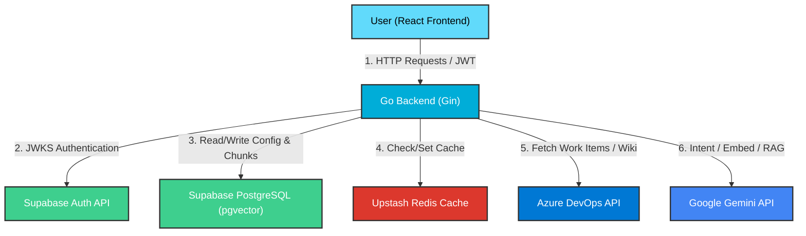
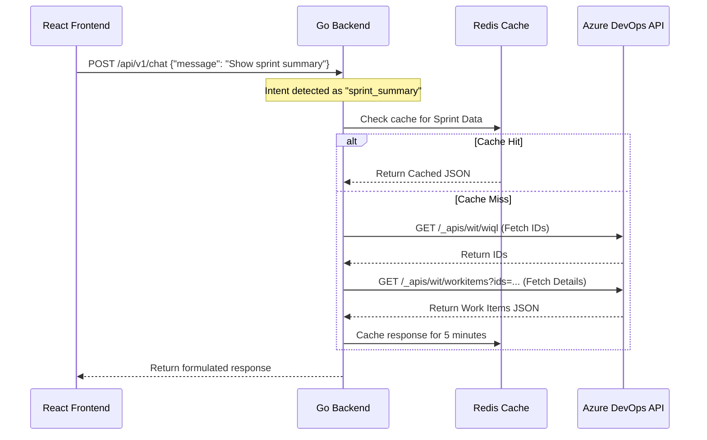
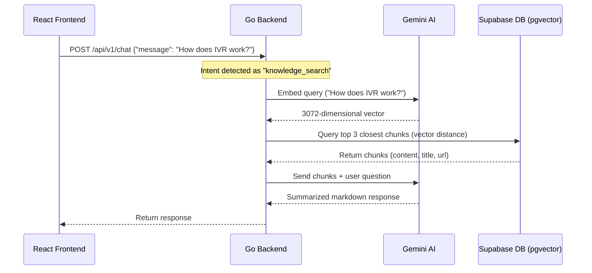
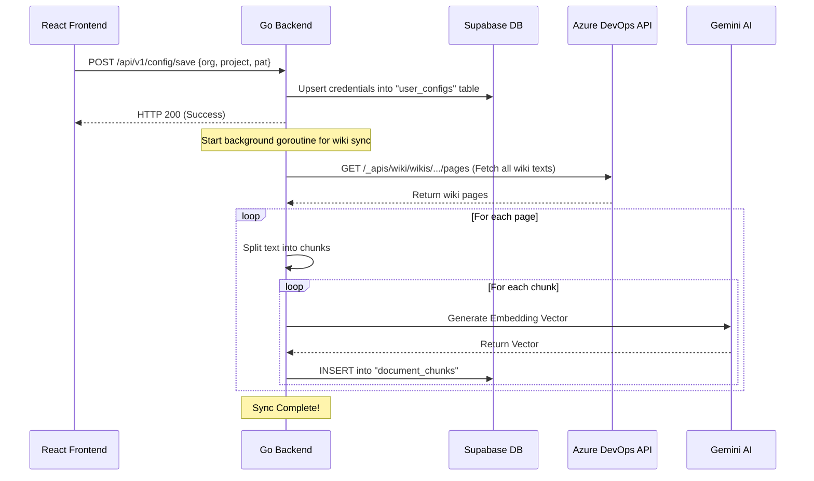

# System Architecture & Flow

This document describes how SprintGPT's frontend, backend, databases, cache layers, and external APIs are connected, how data flows through the system, and where each piece of information is stored.

---

## 1. System Topology Diagram

The following diagram illustrates how all components in SprintGPT connect and communicate:

---

## 2. Where Data is Stored & Retrieved

### 🗄️ Supabase PostgreSQL
We store persistent data here. It is configured with **PGVector** for vector embeddings:
* **`user_configs` table:** Stores user-configured Azure DevOps details (`organization`, `project`, plaintext `pat` token). Each row is keyed by the user's Supabase `user_id`.
* **`document_chunks` table:** Stores RAG knowledge chunks. Columns include `organization`, `project`, `title`, `url`, `content` (plain text), and `embedding` (3072-dimensional vector generated by Gemini).

### ⚡ Upstash Redis Cache
We use Redis exclusively as a high-speed cache for Azure DevOps:
* **Purpose:** Azure DevOps APIs can be slow and are rate-limited. Redis caches search queries (e.g. WIQL queries, sprint/iteration listings, and work item JSON payloads).
* **TTL (Time to Live):** Cached items are stored with an expiration (e.g., 5–10 minutes) so subsequent identical queries return instantly without hitting the Azure DevOps network.

### 🌐 Azure DevOps (Source of Truth)
We do not store project tasks or board data. Whenever you ask for a task status or sprint summary, SprintGPT fetches it live using the user's PAT token.

---

## 3. Core Request Flows

### Flow A: Querying Sprints / Work Items (API Cache Flow)

---

### Flow B: Querying Documentation (RAG Flow)

---

### Flow C: Setting Config & Ingesting Wikis

